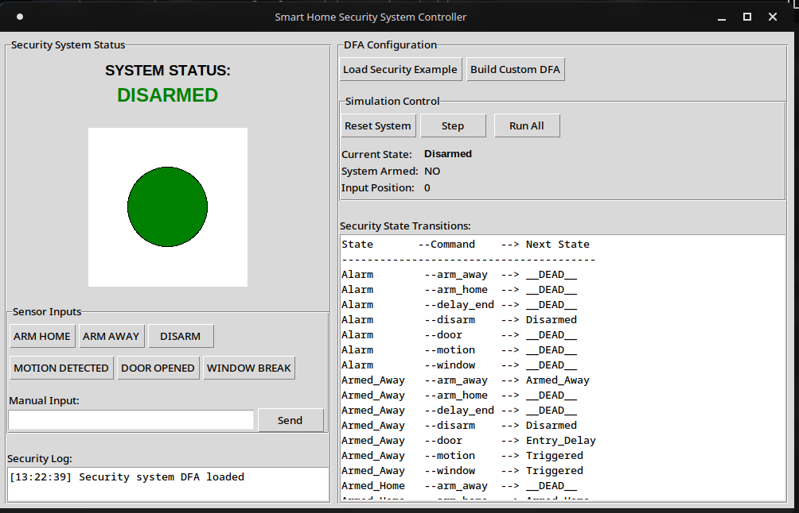

# Smart Home Security System Controller using DFA

A **Python Tkinter application** that simulates a smart home security system using a **Deterministic Finite Automaton (DFA)**. This project models the behavior of a home security system, processes sensor inputs, and provides a visual simulation of system states.

---

## 🛠 Features

- Models security system states:
  - `Disarmed`
  - `Armed_Home`
  - `Armed_Away`
  - `Triggered`
  - `Alarm`
  - `Entry_Delay`
- Processes sensor inputs:
  - Motion detection
  - Door opened
  - Window break
  - Keypad commands (`arm_home`, `arm_away`, `disarm`)
- Visual display of system state with color-coded indicators
- Security log with timestamps
- Step-by-step simulation or full sequence execution
- DFA configuration display and updates
- Manual input for testing custom sequences

---

## ⚙️ Installation

1. **Clone the repository:**

```bash
git clone https://github.com/yourusername/security-dfa-controller.git
cd security-dfa-controller
```

2. **Install dependencies** (Tkinter is usually included with Python):

```bash
pip install automata-lib
```

> Note: Replace `automata-lib` with your DFA implementation if using a custom `automata_dfa.py`.

3. **Run the application:**

```bash
python main.py
```

---

## 📝 Usage

1. **Load Security Example DFA** – Preloaded DFA simulates a standard home security system.
2. **Manual Input** – Type commands like:

```
arm_home motion door
```

and press **Send**.
3. **Step Simulation** – Execute one command at a time.
4. **Run All** – Process the full input sequence.
5. **Reset System** – Return to the initial state.

---

## 🔑 Security Commands

| Command        | Description                     |
|----------------|---------------------------------|
| `arm_home`     | Arm the system while at home    |
| `arm_away`     | Arm the system when away        |
| `disarm`       | Disarm the system               |
| `motion`       | Motion detected by sensor       |
| `door`         | Door opened                     |
| `window`       | Window broken                   |
| `delay_end`    | Entry delay expired             |

> Commands are automatically normalized. For example: `window break` → `window`.

---

## 🗂 Project Structure

```
.
├── main.py            # Main GUI and application logic
├── automata_dfa.py    # DFA implementation
├── README.md          # Project documentation
└── assets/            # Optional images or icons
```

---

## 🔄 How It Works

1. The **DFA** defines valid system states and transitions based on sensor inputs.
2. User inputs (manual or button clicks) are normalized and processed step-by-step or as a sequence.
3. The system visually updates the **current state**, shows whether the system is armed, and logs all events.
4. Invalid commands or transitions are flagged with warnings.

---

## 🚀 Future Improvements

- Custom DFA builder for user-defined security configurations
- Real-time integration with IoT sensors
- Sound or visual alerts for triggered states
- Persist logs to a database or file
- Role-based access control for multiple users

---

## 📄 License

This project is licensed under the MIT License. See [LICENSE](LICENSE) for details.

---

## 👤 Author

[Your Name] – Developer / Security Systems Enthusiast

---

## 📷 Screenshots (Optional)

**Example:**



